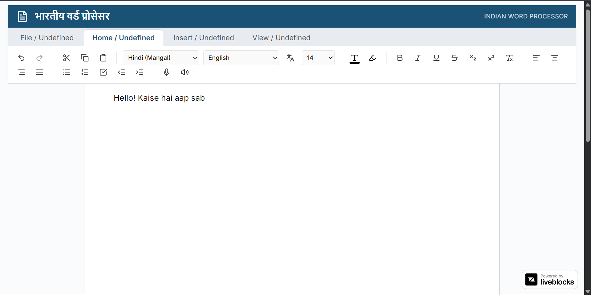

## Project Overview
Ms Doc but for India is a web-based word processing platform designed specifically for Indian users — students, faculty, and organizations. Unlike traditional word processors that are optimized mainly for Western language and usage patterns, this project focuses on Indian languages, accents, writing styles, and real academic needs.

The goal is to Indianise the document creation experience by integrating:

- Multi-lingual Indian language support

- Voice typing for Indian accents

- Low-data and low-resource performance

- AI-assisted academic and research tools

This platform aims to bridge the gap between modern document processing tools and the practical challenges faced by Indian users, especially in education and administration.

🚀 Key Objectives

- Provide a word processor tailored to Indian linguistic diversity

- Support real-time translation and multilingual writing

- Enable efficient document creation even in low-bandwidth environments

- Assist students and faculty with smart academic tools

- Offer a cloud-synced, accessible web solution

## Features
🗣️ Indian Language & Accent Support

- Supports multiple Indian languages (Hindi, Marathi, Tamil, Telugu, Bengali, etc.)

- Voice typing optimized for Indian accents

- Script handling for Indic languages using NLP libraries

🌐 Live Translation

- Real-time translation between Indian languages and English

- Useful for multilingual documents and regional content creation

- Helps students understand and convert content easily

✍️ Smart Writing Assistance

- Grammar and spelling suggestions adapted for Indian usage

- AI-based sentence improvement and paraphrasing

- Style correction for academic and formal writing

🧠 AI Summary & Key Point Extractor

- Automatically summarizes long documents

- Extracts important bullet points

- Helps in quick revision and note-making

☁️ Cloud-Based & Web Accessible

- Web-based platform accessible from any device

- Automatic cloud synchronization

- No installation required

## Getting Started
First Download Docker and Docker Cli
````md
# Docker Installation Guide (macOS & Windows)

This guide explains how to install Docker, verify the Docker CLI, and test Docker on macOS and Windows systems.

---

## What Is Included

Installing Docker Desktop provides:
- Docker Engine
- Docker CLI
- Docker Compose

---

## Installation on macOS

### System Requirements
- macOS 12 or newer
- Apple Silicon (M1/M2/M3) or Intel processor
- Minimum 4 GB RAM (8 GB recommended)

### Installation Steps

1. Download Docker Desktop  
   https://www.docker.com/products/docker-desktop/

2. Choose the correct installer:
   - Mac with Apple chip
   - Mac with Intel chip

3. Install Docker
   - Open the downloaded `.dmg` file
   - Drag `Docker.app` into the `Applications` folder

4. Start Docker
   - Open `Applications → Docker`
   - Grant required permissions
   - Wait until Docker status shows running

---

### Verify Installation (macOS)

Open Terminal and run:
```bash
docker --version
docker compose version
````

### Test Docker (macOS)

```bash
docker run hello-world
```

---

## Installation on Windows (Windows 10/11)

### System Requirements

* Windows 10/11 (64-bit)
* WSL 2 enabled
* Virtualization enabled in BIOS

---

### Step 1: Enable WSL 2

Open PowerShell as Administrator and run:

```powershell
wsl --install
```

Restart the system if prompted.

Verify WSL installation:

```powershell
wsl --version
```

---

### Step 2: Install Docker Desktop

1. Download Docker Desktop
   [https://www.docker.com/products/docker-desktop/](https://www.docker.com/products/docker-desktop/)

2. Run the installer

   * Enable "Use WSL 2 backend" when prompted

3. Restart the system if required

4. Start Docker Desktop

---

### Verify Installation (Windows)

Open PowerShell, Command Prompt, or WSL terminal:

```bash
docker --version
docker compose version
```

### Test Docker (Windows)

```bash
docker run hello-world
```

---

## Common Docker CLI Commands

### Check Docker status

```bash
docker info
```

### Pull an image

```bash
docker pull nginx
```

### Run a container

```bash
docker run -d -p 8080:80 nginx
```

Open in browser:

```
http://localhost:8080
```

### List containers

```bash
docker ps
docker ps -a
```

### Stop a container

```bash
docker stop <container_id>
```

### Remove a container

```bash
docker rm <container_id>
```

---

## Docker Compose Test

Create a file named `docker-compose.yml`:

```yaml
services:
  web:
    image: nginx
    ports:
      - "8080:80"
```

Run:

```bash
docker compose up -d
```

Stop:

```bash
docker compose down
```

---

## Troubleshooting

### docker command not found

* Ensure Docker Desktop is running
* Restart Docker Desktop

### Virtualization error on Windows

* Enable Virtualization in BIOS
* Enable Virtual Machine Platform in Windows Features

### Permission denied error

```bash
sudo docker run hello-world
```

---

## Conclusion
Then build and run the project in docker:

To build the app:
```bash
docker build -t indian-word-processor .
```
To run the app at local Host:
```bash
docker run -d -p 3000:3000 --name my-word-app indian-word-processor
```

Open [http://localhost:3000](http://localhost:3000) with your browser to see the result.

You can start editing the page by modifying `app/page.tsx`. The page auto-updates as you edit the file.

This project uses [`next/font`](https://nextjs.org/docs/app/building-your-application/optimizing/fonts) to automatically optimize and load [Geist](https://vercel.com/font), a new font family for Vercel.

## Project Structure
```bash
Indian_Word_Processor/
├─ convex/
│  ├─ _generated/
│  │  ├─ api.d.ts
│  │  ├─ api.js
│  │  ├─ dataModel.d.ts
│  │  ├─ server.d.ts
│  │  └─ server.js
│  ├─ auth.config.ts
│  ├─ documents.ts
│  ├─ liveblocks.ts
│  ├─ README.md
│  ├─ schema.ts
│  └─ tsconfig.json
├─ src/
│  ├─ app/
│  │  ├─ (auth)/
│  │  │  ├─ signin/
│  │  │  │  └─ signin.tsx
│  │  │  ├─ signup/
│  │  │  │  └─ signup.tsx
│  │  │  └─ layout.tsx
│  │  ├─ documents/
│  │  │  ├─ [documentId]/
│  │  │  │  ├─ editor.tsx
│  │  │  │  ├─ page.tsx
│  │  │  │  ├─ room.tsx
│  │  │  │  └─ toolbar.tsx
│  │  │  └─ page.tsx
│  │  ├─ fonts/
│  │  │  ├─ GeistMonoVF.woff
│  │  │  └─ GeistVF.woff
│  │  ├─ ConvexClientProvider.tsx
│  │  ├─ globals.css
│  │  ├─ layout.tsx
│  │  └─ page.tsx
│  ├─ components/
│  │  └─ ui/
│  │     ├─ accordion.tsx
│  │     ├─ alert-dialog.tsx
│  │     ├─ alert.tsx
│  │     ├─ aspect-ratio.tsx
│  │     ├─ avatar.tsx
│  │     ├─ badge.tsx
│  │     ├─ breadcrumb.tsx
│  │     ├─ button-group.tsx
│  │     ├─ button.tsx
│  │     ├─ calendar.tsx
│  │     ├─ card.tsx
│  │     ├─ carousel.tsx
│  │     ├─ chart.tsx
│  │     ├─ checkbox.tsx
│  │     ├─ collapsible.tsx
│  │     ├─ command.tsx
│  │     ├─ context-menu.tsx
│  │     ├─ convex-client-provider.tsx
│  │     ├─ dialog.tsx
│  │     ├─ drawer.tsx
│  │     ├─ dropdown-menu.tsx
│  │     ├─ empty.tsx
│  │     ├─ field.tsx
│  │     ├─ form.tsx
│  │     ├─ hover-card.tsx
│  │     ├─ input-group.tsx
│  │     ├─ input-otp.tsx
│  │     ├─ input.tsx
│  │     ├─ item.tsx
│  │     ├─ kbd.tsx
│  │     ├─ label.tsx
│  │     ├─ menubar.tsx
│  │     ├─ navigation-menu.tsx
│  │     ├─ pagination.tsx
│  │     ├─ popover.tsx
│  │     ├─ progress.tsx
│  │     ├─ radio-group.tsx
│  │     ├─ resizable.tsx
│  │     ├─ scroll-area.tsx
│  │     ├─ select.tsx
│  │     ├─ separator.tsx
│  │     ├─ sheet.tsx
│  │     ├─ sidebar.tsx
│  │     ├─ skeleton.tsx
│  │     ├─ slider.tsx
│  │     ├─ sonner.tsx
│  │     ├─ spinner.tsx
│  │     ├─ switch.tsx
│  │     ├─ table.tsx
│  │     ├─ tabs.tsx
│  │     ├─ textarea.tsx
│  │     ├─ toast.tsx
│  │     ├─ toaster.tsx
│  │     ├─ toggle-group.tsx
│  │     ├─ toggle.tsx
│  │     └─ tooltip.tsx
│  ├─ extensions/
│  │  └─ indic-transliteration.ts
│  ├─ hooks/
│  │  ├─ use-mobile.tsx
│  │  └─ use-toast.ts
│  ├─ lib/
│  │  ├─ translate.ts
│  │  ├─ translations.ts
│  │  └─ utils.ts
│  └─ store/
│     ├─ use-editor-store.ts
│     └─ use-language-store.ts
├─ .dockerignore
├─ .eslintrc.json
├─ .gitignore
├─ components.json
├─ desktop.ini
├─ docker-compose.yml
├─ Dockerfile
├─ gemini.md
├─ image.png
├─ next.config.ts
├─ package-lock.json
├─ package.json
├─ postcss.config.mjs
├─ README.md
├─ tailwind.config.ts
└─ tsconfig.json

```
## Learn More

To learn more about Next.js, take a look at the following resources:

- [Next.js Documentation](https://nextjs.org/docs) - learn about Next.js features and API.
- [Learn Next.js](https://nextjs.org/learn) - an interactive Next.js tutorial.

You can check out [the Next.js GitHub repository](https://github.com/vercel/next.js) - your feedback and contributions are welcome!